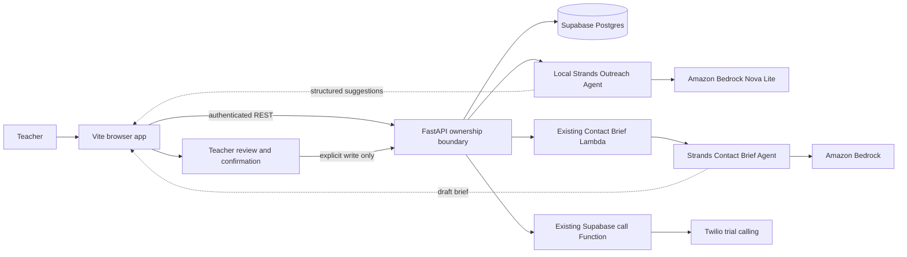

# ContactLoop

ContactLoop is a teacher-controlled family outreach assistant for special-education
teams. It helps a teacher decide who needs contact, understand the recorded context,
and prepare the next step without sending a message, placing a call, or creating a
follow-up on the teacher's behalf.

This project is being built for the 2026 **Agents for Humans** hackathon with the
[Strands Agents SDK](https://strandsagents.com/) and Amazon Bedrock.

> Privacy note: the repository and demonstration use fictional student and guardian
> records only. Do not enter real student information into a public demo.

## What the agent does

The Outreach Agent reads a minimized, owner-scoped view of the signed-in teacher's
records and returns a structured daily plan:

- who may need outreach;
- why that student was prioritized; and
- a suggested next step grounded in the supplied records.

The result is advice, not an automatic action. A teacher must review a recommendation
and explicitly click **Create follow-up** before ContactLoop writes a follow-up. The
agent never receives phone numbers, provider identifiers, access tokens, or service
credentials.

ContactLoop also generates a Contact Brief for one selected student. That brief is
saved as a draft and remains editable until a teacher approves it.

## Demo features

- Authenticated teacher accounts and owner-isolated student records
- Student, guardian, contact-event, teacher-note, and follow-up workflows
- A real Outreach Agent powered by Strands and Amazon Nova Lite
- A real Contact Brief powered by the existing Strands/Bedrock Lambda
- Teacher review, editing, approval, and versioning for AI briefs
- Optional Twilio trial calling through a protected server-side path
- Clear duplicate-follow-up protection and safe upstream error messages

Twilio trial accounts can call only numbers verified in that Twilio account. This is
an expected trial limitation, not a ContactLoop error. Judges can evaluate the full
agent workflow without placing a real call.

## Architecture

The browser sends application data only to the authenticated FastAPI REST API.
FastAPI enforces ownership before reading or changing Supabase data and before
building any Agent context.



Supabase service credentials, AWS credentials, and the Lambda endpoint stay on the
server. See the [interactive architecture diagram](docs/architecture.html) for the
complete data flow.

## Local setup

### Requirements

- Node.js 20 or newer
- Python 3.11 or newer
- An AWS account with Bedrock access only if running the live Agent features
- A Supabase project only if running the shared authenticated Demo database

The core app can use local SQLite, but the shared Demo and live integrations require
their corresponding server-side configuration.

### 1. Install the backend

From the repository root:

```bash
python3 -m venv .venv
source .venv/bin/activate
python -m pip install -r backend/requirements.txt
cp backend/.env.example backend/.env
```

Edit `backend/.env` locally. Never commit that file and never put server credentials
in a variable beginning with `VITE_`.

Start FastAPI:

```bash
cd backend
../.venv/bin/python -m uvicorn app.main:app --reload --host 127.0.0.1 --port 8000
```

### 2. Install the frontend

In a second terminal, from the repository root:

```bash
npm install
cp .env.example .env.local
npm run dev
```

Open `http://127.0.0.1:5173/`. Do not open `index.html` with a `file://` URL.

The checked-in frontend example uses safe defaults. Set
`VITE_CONTACT_BRIEF_PROVIDER=aws-strands-bedrock` only when the backend Contact Brief
path is configured. Set `VITE_TELEPHONY_PROVIDER=twilio` only for an intentional test
with a verified Twilio trial number.

### 3. AWS configuration for the local Outreach Agent

ContactLoop uses the normal AWS credential provider chain. Configure credentials on
the server or local machine; never paste access keys into this repository or the
browser configuration.

The Demo uses:

```text
AWS_REGION=us-east-2
BEDROCK_MODEL_ID=amazon.nova-lite-v1:0
```

The IAM identity should have only the Bedrock model-list permissions needed for
inspection and invoke permissions limited to the Nova Lite foundation-model ARN.
No AWS Marketplace model subscription is required for this configuration.

## Safe Demo walkthrough

1. Sign in as the Demo teacher and confirm only fictional owned students appear.
2. Click **Refresh with Agent** in the Outreach Plan card.
3. Review the returned `Agent suggestions`: student, reason, priority, and next step.
4. Open **Review** to inspect the fictional student's recorded context.
5. Show that no follow-up was created during generation.
6. If desired, click **Create follow-up** and confirm the action manually. An existing
   open follow-up is safely rejected instead of duplicated.
7. Generate a Contact Brief, then show its `Needs teacher review` draft state and
   teacher approval controls.

Do not place a real Twilio call during a public demonstration unless the account
owner intentionally triggers it using a verified trial number.

## Verification

From the repository root:

```bash
.venv/bin/python -m pytest backend/tests -q
npm test
npm run build
git diff --check
```

## Repository map

```text
backend/app/                         FastAPI API, authorization, data access, Agents
backend/app/services/outreach_plan_agent.py
                                     Local Strands Outreach Agent
ai/contact_brief/                    Existing Contact Brief Lambda provider code
src/                                 Vite browser application
supabase/                            Database schema, migrations, and Edge Functions
docs/architecture.html               Current end-to-end architecture diagram
```

## Hackathon disclosure

ContactLoop is the submission project developed during the Agents for Humans build
period. The repository history may include earlier UI, data-model, and communication
workflow foundations that were incorporated into the submission; the Strands Agent
workflows, FastAPI security boundary, owner isolation, and teacher-controlled Agent
experience described here were built for this submission. Standard open-source
frameworks and libraries are listed in `package.json`, `backend/requirements.txt`,
and `ai/requirements.txt`.

## License

ContactLoop is released under the [MIT License](LICENSE).
